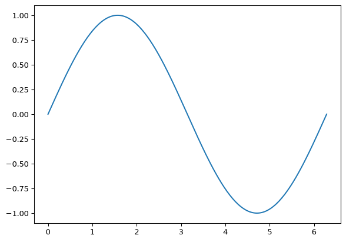

Links back to [test-note](../test-note).

The identity $\E[X+Y] = \E[X] + \E[Y]$ holds even when $X \not\indep Y$.

``` python
import numpy as np
import matplotlib.pyplot as plt
x = np.linspace(0, 2 * np.pi, 200)
plt.plot(x, np.sin(x))
plt.show()
```

<div id="fig-sine">



Figure 1: A sine wave, executed at render time

</div>

``` python
print(f"computed at render time: {np.trapezoid(np.sin(x), x):.4f}")
```

    computed at render time: 0.0000
